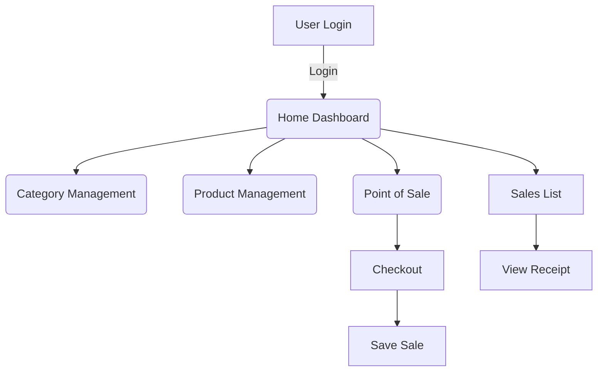

# POS Project Django Views Documentation

This Django `views.py` file implements the main application logic for a Point of Sale (POS) system. It handles authentication, CRUD operations for categories and products, POS transactions, sales reports, and receipt generation. Each view corresponds to a web page or AJAX endpoint, secured with authentication where necessary.

---

## ⚡️ Authentication Views

Authentication ensures only authorized users can access the POS system.

### `login_user(request)`

Handles user login, checks credentials, and starts a session.

```python
def login_user(request):
    logout(request)
    resp = {"status": 'failed', 'msg': ''}
    username = ''
    password = ''
    if request.POST:
        username = request.POST['username']
        password = request.POST['password']
        user = authenticate(username=username, password=password)
        if user is not None:
            if user.is_active:
                login(request, user)
                resp['status'] = 'success'
            else:
                resp['msg'] = "Incorrect username or password"
        else:
            resp['msg'] = "Incorrect username or password"
    return HttpResponse(json.dumps(resp), content_type='application/json')
```

- Logs out any active session before new login.
- Returns JSON status: `success` or `failed`.

```api
{
    "title": "User Login",
    "description": "Authenticate with username and password to start a session.",
    "method": "POST",
    "baseUrl": "https://yourdomain.com",
    "endpoint": "/login_user",
    "headers": [],
    "queryParams": [],
    "pathParams": [],
    "bodyType": "form",
    "requestBody": "username=admin&password=admin123",
    "formData": [
        {
            "key": "username",
            "value": "User's username",
            "required": true
        },
        {
            "key": "password",
            "value": "User's password",
            "required": true
        }
    ],
    "responses": {
        "200": {
            "description": "Login response",
            "body": "{\n  \"status\": \"success\"\n}"
        },
        "401": {
            "description": "Invalid credentials",
            "body": "{\n  \"status\": \"failed\",\n  \"msg\": \"Incorrect username or password\"\n}"
        }
    }
}
```

---

### `logoutuser(request)`

Logs out the current user and redirects to the homepage.

```python
def logoutuser(request):
    logout(request)
    return redirect('/')
```

---

## 🏠 Home and About Views

### `home(request)`

Displays the dashboard with summary statistics for the POS system.

- Shows counts for categories, products, and today's transactions.
- Sums today's and yearly sales.

```python
@login_required
def home(request):
    now = datetime.now()
    current_year = now.strftime("%Y")
    current_month = now.strftime("%m")
    current_day = now.strftime("%d")
    categories = len(Category.objects.all())
    products = len(Products.objects.all())
    transaction = len(Sales.objects.filter(
        date_added__year=current_year,
        date_added__month=current_month,
        date_added__day=current_day
    ))
    today_sales = Sales.objects.filter(
        date_added__year=current_year,
        date_added__month=current_month,
        date_added__day=current_day
    ).all()
    yearly_sales = Sales.objects.filter(
        date_added__year=current_year,
    ).all()
    transaction_total = len(Sales.objects.filter(
        date_added__year=current_year,
    ))
    total_sales = sum(today_sales.values_list('grand_total', flat=True))
    context = {
        'page_title': 'Home',
        'categories': categories,
        'products': products,
        'transaction': transaction,
        'yearly_sales': sum(yearly_sales.values_list('grand_total', flat=True)),
        'transaction_total': transaction_total,
        'total_sales': total_sales
    }
    return render(request, 'posApp/home.html', context)
```

---

### `about(request)`

Renders a static About page for the POS system.

```python
def about(request):
    context = {
        'page_title': 'About',
    }
    return render(request, 'posApp/about.html', context)
```

---

## 📁 Category Management

These views enable managing product categories in the POS system.

### `category(request)`

Lists all categories.

```python
@login_required
def category(request):
    category_list = Category.objects.all()
    context = {
        'page_title': 'Category List',
        'category': category_list,
    }
    return render(request, 'posApp/category.html', context)
```

---

### `manage_category(request)`

Renders the form for creating or editing a category.

- If `id` is provided, loads the existing category for editing.

---

### `save_category(request)`

Handles creation and updating of categories.

```python
@login_required
def save_category(request):
    data = request.POST
    resp = {'status': 'failed'}
    try:
        if (data['id']).isnumeric() and int(data['id']) > 0:
            save_category = Category.objects.filter(id=data['id']).update(
                name=data['name'],
                description=data['description'],
                status=data['status']
            )
        else:
            save_category = Category(
                name=data['name'],
                description=data['description'],
                status=data['status']
            )
            save_category.save()
        resp['status'] = 'success'
        messages.success(request, 'Category Successfully saved.')
    except:
        resp['status'] = 'failed'
    return HttpResponse(json.dumps(resp), content_type="application/json")
```

```api
{
    "title": "Save Category",
    "description": "Create or update a category.",
    "method": "POST",
    "baseUrl": "https://yourdomain.com",
    "endpoint": "/save_category",
    "headers": [],
    "queryParams": [],
    "pathParams": [],
    "bodyType": "form",
    "requestBody": "id=1&name=Beverages&description=Drinks&status=1",
    "formData": [
        {"key": "id", "value": "Category ID (empty for new)", "required": false},
        {"key": "name", "value": "Category name", "required": true},
        {"key": "description", "value": "Description", "required": false},
        {"key": "status", "value": "Status (1=active, 0=inactive)", "required": true}
    ],
    "responses": {
        "200": {
            "description": "Success or failure",
            "body": "{\n  \"status\": \"success\"\n}"
        }
    }
}
```

---

### `delete_category(request)`

Deletes a category by ID.

```python
@login_required
def delete_category(request):
    data = request.POST
    resp = {'status': ''}
    try:
        Category.objects.filter(id=data['id']).delete()
        resp['status'] = 'success'
        messages.success(request, 'Category Successfully deleted.')
    except:
        resp['status'] = 'failed'
    return HttpResponse(json.dumps(resp), content_type="application/json")
```

```api
{
    "title": "Delete Category",
    "description": "Delete a category by its ID.",
    "method": "POST",
    "baseUrl": "https://yourdomain.com",
    "endpoint": "/delete_category",
    "headers": [],
    "queryParams": [],
    "pathParams": [],
    "bodyType": "form",
    "requestBody": "id=3",
    "formData": [
        {"key": "id", "value": "Category ID", "required": true}
    ],
    "responses": {
        "200": {
            "description": "Success or failure",
            "body": "{\n  \"status\": \"success\"\n}"
        }
    }
}
```

---

## 📦 Product Management

Product-related views allow listing, adding, editing, and deleting products.

### `products(request)`

Lists all products.

---

### `manage_products(request)`

Renders the add/edit form for products, with available categories.

---

### `save_product(request)`

Creates or updates a product. Checks for unique product codes.

```python
@login_required
def save_product(request):
    data = request.POST
    resp = {'status': 'failed'}
    id = ''
    if 'id' in data:
        id = data['id']
    if id.isnumeric() and int(id) > 0:
        check = Products.objects.exclude(id=id).filter(code=data['code']).all()
    else:
        check = Products.objects.filter(code=data['code']).all()
    if len(check) > 0:
        resp['msg'] = "Product Code Already Exists in the database"
    else:
        category = Category.objects.filter(id=data['category_id']).first()
        try:
            if (data['id']).isnumeric() and int(data['id']) > 0:
                save_product = Products.objects.filter(id=data['id']).update(
                    code=data['code'],
                    category_id=category,
                    name=data['name'],
                    description=data['description'],
                    price=float(data['price']),
                    status=data['status']
                )
            else:
                save_product = Products(
                    code=data['code'],
                    category_id=category,
                    name=data['name'],
                    description=data['description'],
                    price=float(data['price']),
                    status=data['status']
                )
                save_product.save()
            resp['status'] = 'success'
            messages.success(request, 'Product Successfully saved.')
        except:
            resp['status'] = 'failed'
    return HttpResponse(json.dumps(resp), content_type="application/json")
```

```api
{
    "title": "Save Product",
    "description": "Create or update a product.",
    "method": "POST",
    "baseUrl": "https://yourdomain.com",
    "endpoint": "/save_product",
    "headers": [],
    "bodyType": "form",
    "requestBody": "id=1&code=P001&category_id=2&name=Pepsi&description=Soft drink&price=1.5&status=1",
    "formData": [
        {"key": "id", "value": "Product ID (empty for new)", "required": false},
        {"key": "code", "value": "Unique product code", "required": true},
        {"key": "category_id", "value": "Category ID", "required": true},
        {"key": "name", "value": "Product name", "required": true},
        {"key": "description", "value": "Product description", "required": false},
        {"key": "price", "value": "Product price", "required": true},
        {"key": "status", "value": "Status (1=active, 0=inactive)", "required": true}
    ],
    "responses": {
        "200": {
            "description": "Save status",
            "body": "{\n  \"status\": \"success\"\n}"
        }
    }
}
```

---

### `delete_product(request)`

Deletes a product by ID.

```api
{
    "title": "Delete Product",
    "description": "Delete a product by its ID.",
    "method": "POST",
    "baseUrl": "https://yourdomain.com",
    "endpoint": "/delete_product",
    "headers": [],
    "bodyType": "form",
    "requestBody": "id=7",
    "formData": [
        {"key": "id", "value": "Product ID", "required": true}
    ],
    "responses": {
        "200": {
            "description": "Success or failure",
            "body": "{\n  \"status\": \"success\"\n}"
        }
    }
}
```

---

## 🛒 Point of Sale and Transactions

### `pos(request)`

Displays the POS interface with a list of active products.

---

### `checkout_modal(request)`

Renders the checkout modal dialog, showing the grand total.

---

### `save_pos(request)`

Records a completed sale and saves all associated sale items.

- Generates a unique sale code.
- Iterates over products, saving each item to the sales record.

```api
{
    "title": "Save POS Transaction",
    "description": "Saves a sale and its items in the POS system.",
    "method": "POST",
    "baseUrl": "https://yourdomain.com",
    "endpoint": "/save_pos",
    "headers": [],
    "bodyType": "form",
    "requestBody": "sub_total=100&tax=10&tax_amount=10&grand_total=110&tendered_amount=120&amount_change=10&product_id[]=1&qty[]=2&price[]=50",
    "formData": [
        {"key": "sub_total", "value": "Total before tax", "required": true},
        {"key": "tax", "value": "Tax percentage", "required": true},
        {"key": "tax_amount", "value": "Tax amount", "required": true},
        {"key": "grand_total", "value": "Grand total", "required": true},
        {"key": "tendered_amount", "value": "Amount paid", "required": true},
        {"key": "amount_change", "value": "Change returned", "required": true},
        {"key": "product_id[]", "value": "Product IDs (array)", "required": true},
        {"key": "qty[]", "value": "Quantities (array)", "required": true},
        {"key": "price[]", "value": "Prices (array)", "required": true}
    ],
    "responses": {
        "200": {
            "description": "Sale status",
            "body": "{\n  \"status\": \"success\",\n  \"sale_id\": 15\n}"
        }
    }
}
```

---

### `salesList(request)`

Shows all sales transactions, including item details and counts.

---

### `receipt(request)`

Renders a detailed sale receipt, including itemized list and transaction totals.

---

### `delete_sale(request)`

Deletes a sale by ID.

```api
{
    "title": "Delete Sale",
    "description": "Delete a sale record by its ID.",
    "method": "POST",
    "baseUrl": "https://yourdomain.com",
    "endpoint": "/delete_sale",
    "headers": [],
    "bodyType": "form",
    "requestBody": "id=10",
    "formData": [
        {"key": "id", "value": "Sale ID", "required": true}
    ],
    "responses": {
        "200": {
            "description": "Success or failure",
            "body": "{\n  \"status\": \"success\"\n}"
        }
    }
}
```

---

## 🧑‍💻 Developer Notes

### General Flow of the POS System



---

## Key Takeaways

```card
{
    "title": "Authentication Required",
    "content": "Most views require login. Always use @login_required for POS business logic views."
}
```

```card
{
    "title": "Atomic Transactions",
    "content": "Sales and sale items should be saved atomically to ensure data consistency."
}
```

---

## Summary Table of Main Views

| View Name           | Purpose                                   | URL Pattern          | Method      | Login Required |
|---------------------|-------------------------------------------|----------------------|-------------|---------------|
| login_user          | User login/authentication                 | /login_user          | POST        | No            |
| logoutuser          | User logout                               | /logoutuser          | GET         | No            |
| home                | Dashboard with stats                      | /                    | GET         | Yes           |
| about               | About page                                | /about               | GET         | No            |
| category            | List categories                           | /category            | GET         | Yes           |
| manage_category     | Add/edit category form                    | /manage_category     | GET         | Yes           |
| save_category       | Save category (add/update)                | /save_category       | POST        | Yes           |
| delete_category     | Delete category                           | /delete_category     | POST        | Yes           |
| products            | List products                             | /products            | GET         | Yes           |
| manage_products     | Add/edit product form                     | /manage_products     | GET         | Yes           |
| save_product        | Save product (add/update)                 | /save_product        | POST        | Yes           |
| delete_product      | Delete product                            | /delete_product      | POST        | Yes           |
| pos                 | POS transaction interface                 | /pos                 | GET         | Yes           |
| checkout_modal      | Modal for checkout                        | /checkout_modal      | GET         | Yes           |
| save_pos            | Save sales transaction                    | /save_pos            | POST        | Yes           |
| salesList           | View all sales                            | /salesList           | GET         | Yes           |
| receipt             | View receipt for a sale                   | /receipt?id=<id>     | GET         | Yes           |
| delete_sale         | Delete a sale                             | /delete_sale         | POST        | Yes           |

---

## Final Notes

- It connects user interactions, business logic, and the data layer (models).
- Proper authentication, error handling, and user feedback are implemented throughout.

Feel free to extend or customize these views to fit your business requirements!
